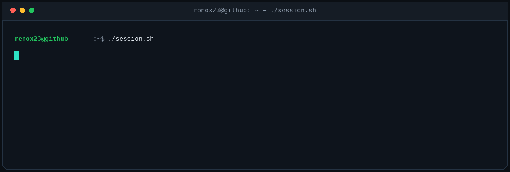
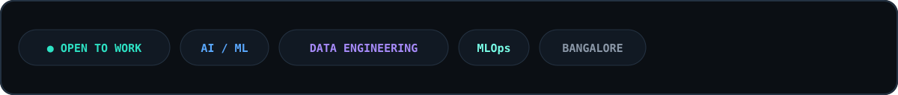
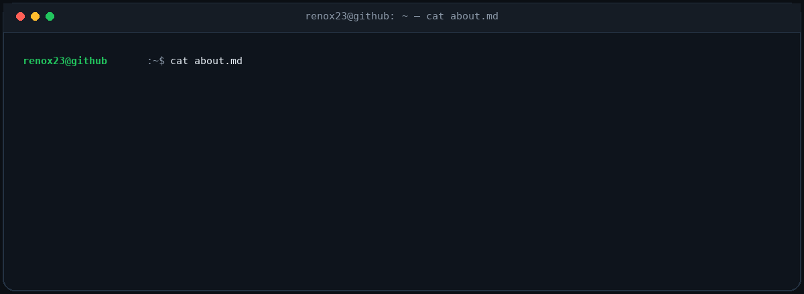
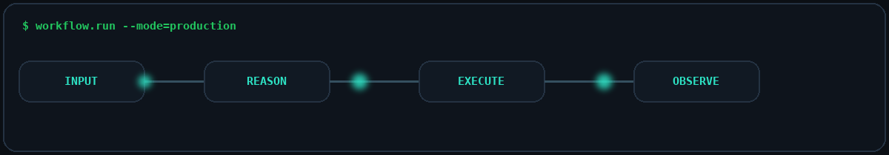
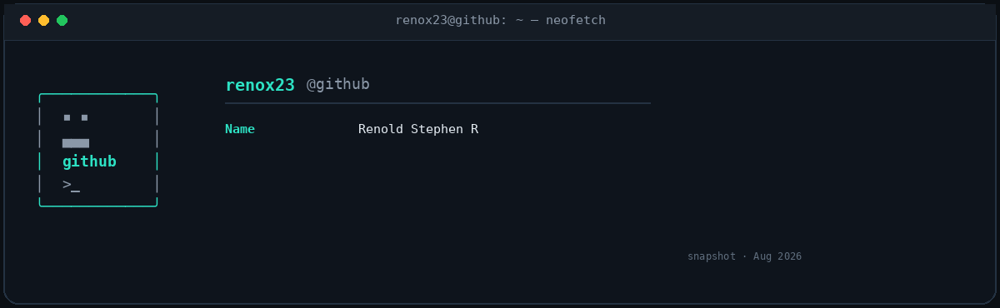
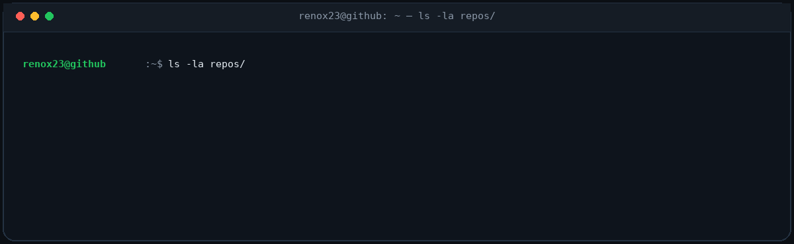
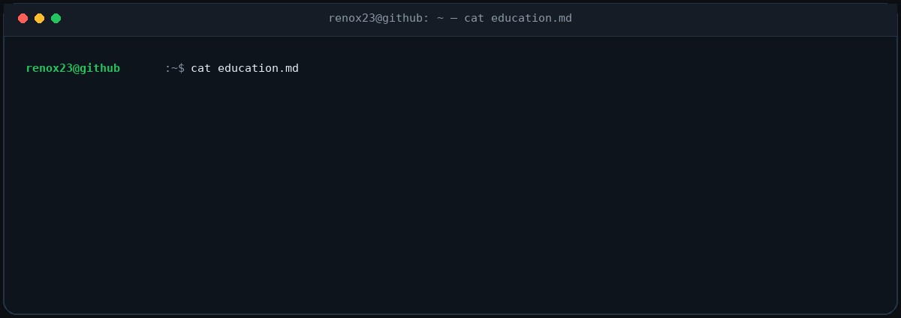
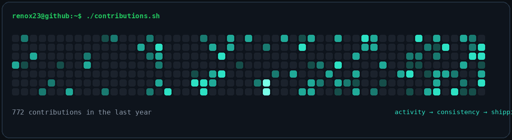
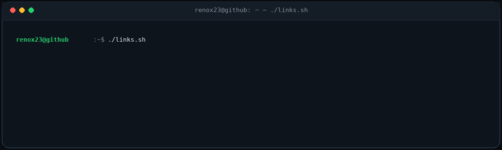

<!-- Animated Waving Header -->

  

<!-- Status Badges -->

  
  
  

  
<!-- Animated Neon Typing Terminal -->

  
  
  

~/about

~/workflow

The pattern: turn ambiguous problems into observable systems.

INPUT → REASON → EXECUTE → OBSERVE

~/stack

🛠️ Tech Stack & Arsenal

<b>🌐 Languages & Core Tech</b>

 

 

<b>💻 Frameworks & Libraries</b>

 

 

<b>🗄️ Database & Cloud</b>

 

 

<b>🤖 AI & Data Science</b>

 

  

 

<b>⚙️ Infrastructure & MLOps</b>

 

  

~/github-stats

~/projects

<table>
<tr>
<td width="50%" valign="top">

🧠 InternIQ

Ask the market — not the spreadsheet.

A 4-agent LangGraph analyst that turns internship listings into NL → SQL → Viz → Insight workflows over PostgreSQL.

LangGraph PostgreSQL Groq Streamlit

Repository · Live Demo

</td>
<td width="50%" valign="top">

⚙️ KubeIQ

Turn telemetry into evidence-backed RCA.

Isolation Forest detects anomalous Kubernetes pods; TF-IDF RAG retrieves runbooks; an LLM produces structured Root Cause → Evidence → Remediation.

Isolation Forest Prometheus RAG Kubernetes

Repository

</td>
</tr>

<tr>
<td width="50%" valign="top">

📈 DORA Metrics

Turn GitHub activity into engineering signals.

GitHub API → SQLite → Streamlit pipeline that converts PRs, releases, and issues into measurable delivery intelligence.

PyGithub SQLite Streamlit Plotly

Repository · Live Demo

</td>
<td width="50%" valign="top">

🔁 GitOps Monitoring

Make Git the operational control plane.

ArgoCD reconciles deployments, Terraform provisions infrastructure, and Prometheus + Grafana provide the feedback loop.

ArgoCD Terraform Prometheus Grafana

Repository

</td>
</tr>
</table>

~/education

<table>
<tr>
<td width="50%" valign="top">

🎓 M.Tech — Computer Science

Christ University, Bangalore

AI Systems · Data Engineering · Cloud-Native MLOps

</td>
<td width="50%" valign="top">

💻 B.E. — Information Science

Cambridge Institute of Technology

Full-Stack Development · DevOps · Systems Engineering

</td>
</tr>
<tr>
<td width="50%" valign="top">

📜 Publication

YOLOv5 + Raspberry Pi Assistive Navigation System

Published in IJIRT · 2025

</td>
<td width="50%" valign="top">

🏆 Recognition

Microsoft Learn Student Ambassador

Bangalore · Open to AI/ML, Data & MLOps roles

</td>
</tr>
</table>

~/activity

 

 

~/connect

  

> let's build something useful together.

RenoX23 · AI Systems · Data Engineering · MLOps

