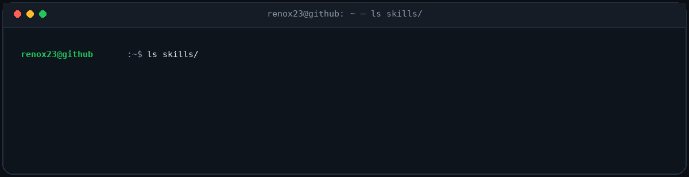

<!-- Animated Waving Header -->

  

<!-- Status Badges -->

  
  
  

  
<!-- Animated Neon Typing Terminal -->

---
## `~/about`

---
## `~/workflow`

**The pattern:** turn ambiguous problems into observable systems.

`INPUT` → `REASON` → `EXECUTE` → `OBSERVE`

---

## `~/stack`

### 🔧 Tech Stack

**AI & Agents**

**Data Engineering**

**Infrastructure & MLOps**

**Languages & Tooling**

---

## `~/github-stats`

---

## `~/projects`

<table>
<tr>
<td width="50%" valign="top">

### 🧠 InternIQ
**Ask the market — not the spreadsheet.**

A 4-agent LangGraph analyst that turns internship listings into **NL → SQL → Viz → Insight** workflows over PostgreSQL.

`LangGraph` `PostgreSQL` `Groq` `Streamlit`

[Repository](https://github.com/RenoX23/interniq-multiagent-analyst) · [Live Demo](https://interniq-multiagent-analyst-renox23.streamlit.app/)

</td>
<td width="50%" valign="top">

### ⚙️ KubeIQ
**Turn telemetry into evidence-backed RCA.**

Isolation Forest detects anomalous Kubernetes pods; TF-IDF RAG retrieves runbooks; an LLM produces structured **Root Cause → Evidence → Remediation**.

`Isolation Forest` `Prometheus` `RAG` `Kubernetes`

[Repository](https://github.com/RenoX23/kubeiq-ops-agent)

</td>
</tr>

<tr>
<td width="50%" valign="top">

### 📈 DORA Metrics
**Turn GitHub activity into engineering signals.**

GitHub API → SQLite → Streamlit pipeline that converts PRs, releases, and issues into measurable delivery intelligence.

`PyGithub` `SQLite` `Streamlit` `Plotly`

[Repository](https://github.com/RenoX23/dora-metrics-dashboard) · [Live Demo](https://renox23-dora-metrics-dashboard.streamlit.app/)

</td>
<td width="50%" valign="top">

### 🔁 GitOps Monitoring
**Make Git the operational control plane.**

ArgoCD reconciles deployments, Terraform provisions infrastructure, and Prometheus + Grafana provide the feedback loop.

`ArgoCD` `Terraform` `Prometheus` `Grafana`

[Repository](https://github.com/RenoX23/gitops-monitoring-project)

</td>
</tr>
</table>

---
## `~/education`

<table>
<tr>
<td width="50%" valign="top">

### 🎓 M.Tech — Computer Science
**Christ University, Bangalore**

AI Systems · Data Engineering · Cloud-Native MLOps

</td>
<td width="50%" valign="top">

### 💻 B.E. — Information Science
**Cambridge Institute of Technology**

Full-Stack Development · DevOps · Systems Engineering

</td>
</tr>
<tr>
<td width="50%" valign="top">

### 📜 Publication
**YOLOv5 + Raspberry Pi Assistive Navigation System**

Published in **IJIRT · 2025**

</td>
<td width="50%" valign="top">

### 🏆 Recognition
**Microsoft Learn Student Ambassador**

Bangalore · Open to AI/ML, Data & MLOps roles

</td>
</tr>
</table>

---
## `~/activity`

 

 

---

## `~/connect`

  

### `> let's build something useful together.`

---

`RenoX23` · AI Systems · Data Engineering · MLOps

