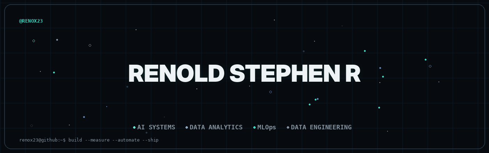
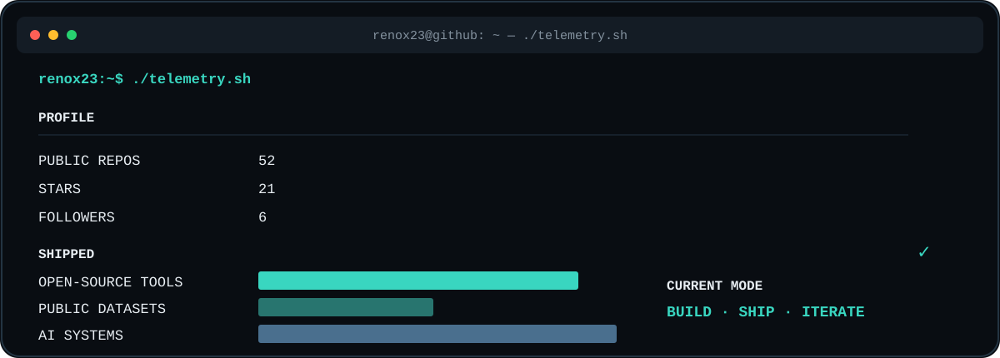

<div align="center">



<br/>

<a href="https://github.com/RenoX23">
  
</a>
<a href="https://www.linkedin.com/in/renoldstephen/">
  
</a>
<a href="mailto:renoldstephen23@gmail.com">
  
</a>
<a href="https://renox23-portfolio.vercel.app/">
  
</a>

<br/><br/>


</div>
<br>
<div align="center"> <a href="https://github.com/RenoX23">  </a> <a href="https://github.com/RenoX23?tab=stars">  </a> <a href="https://komarev.com/ghpvc/?username=RenoX23">  </a> </div>

---

## `~/identity`

<table>
<tr>
<td width="62%" valign="top">

### 🤖 AI Systems Engineer

I build and ship **AI systems, data products, open-source tools, and public datasets**.

My work sits at the intersection of:

`AI Agents` · `ML Systems` · `Data Analytics` · `MLOps` · `Data Engineering`

I care about turning ideas into systems that are **useful, observable, and deployable** — not just notebook experiments.

</td>

<td width="38%" valign="top">

```text
STATUS
────────────────────────
● OPEN TO WORK

FOCUS
────────────────────────
AI Systems
Data Products
Open Source
Public Data

BASE
────────────────────────
Bangalore, India

DEGREE
────────────────────────
M.Tech CS
```

</td>
</tr>
</table>

---

## `~/what-i-build`

<div align="center">

<table>
<tr>
<td align="center" width="25%">

### 🤖
**AI AGENTS**

Multi-step AI workflows, tool use, reasoning, RAG, and NL2SQL.

</td>
<td align="center" width="25%">

### 📊
**DATA PRODUCTS**

Analytics pipelines, dashboards, datasets, and decision-support tools.

</td>
<td align="center" width="25%">

### ⚙️
**ML SYSTEMS**

Monitoring, anomaly detection, intelligent infrastructure, and MLOps.

</td>
<td align="center" width="25%">

### 🌐
**OPEN SOURCE**

Developer tools and reusable systems shipped for others to use.

</td>
</tr>
</table>

</div>

> **Build → ship → measure → improve**

---

## `~/featured`

<div align="center">

<table>
<tr>
<td width="50%" valign="top">

### 🧩 AI Agent Workflow

**Visual orchestration for building AI agent workflows.**

A developer-focused tool for composing, inspecting, and iterating on agent workflows without hiding the system behind a black box.

`TypeScript` `AI Agents` `Workflow Design`

<br/>

<a href="https://github.com/RenoX23/ai-agent-workflow-builder">

</a>

</td>

<td width="50%" valign="top">

### 🔨 DataForge

**Open tooling for generating useful synthetic data.**

A dataset-generation project designed around controllable, reusable data creation rather than toy random records.

`Python` `Data Engineering` `Open Source`

<br/>

<a href="https://github.com/RenoX23/DataForge">

</a>

</td>
</tr>

<tr>
<td width="50%" valign="top">

### 🧠 GenAI Data Quality Explainer

**Turn data-quality failures into explanations people can act on.**

Combines data-quality signals with GenAI to explain what went wrong, why it matters, and what to investigate next.

`Python` `GenAI` `Data Quality`

<br/>

<a href="https://github.com/RenoX23/genai-dq-explainer">

</a>

</td>

<td width="50%" valign="top">

### 🔁 GitOps Pipeline

**A production-style CI/CD workflow built around Git as the control plane.**

Automates delivery and infrastructure operations across containerized workloads with a strong focus on repeatability and observability.

`GitOps` `Kubernetes` `CI/CD` `MLOps`

<br/>

<a href="https://github.com/RenoX23/devops-gitops-ci">

</a>

</td>
</tr>
</table>

</div>

---

## `~/stack`

### 🤖 AI & Intelligent Systems

<div align="center">


<br/><br/>


</div>

### 📊 Data & Analytics

<div align="center">


<br/><br/>


</div>

### ⚙️ Cloud, Infrastructure & MLOps

<div align="center">


<br/><br/>


</div>

---

## `~/background`

<table>
<tr>
<td width="50%" valign="top">

### 🎓 M.Tech — Computer Science

**Christ University, Bangalore**

AI Systems · Data Engineering · Cloud-Native MLOps

</td>
<td width="50%" valign="top">

### 💻 B.Tech — Information Science

**Cambridge Institute of Technology**

Full-Stack Development · DevOps

</td>
</tr>
</table>

<div align="center">


</div>

---

## `~/telemetry`

<div align="center">



</div>

---

## `~/connect`

<div align="center">

<a href="https://github.com/RenoX23">
  
</a>
<a href="https://www.linkedin.com/in/renoldstephen/">
  
</a>
<a href="mailto:renoldstephen23@gmail.com">
  
</a>
<a href="https://renox23-portfolio.vercel.app/">
  
</a>

<br/><br/>

`> let's build something useful together.`

</div>

---

<div align="center">

`RenoX23` · AI Systems · Data Analytics · MLOps · Data Engineering

</div>
